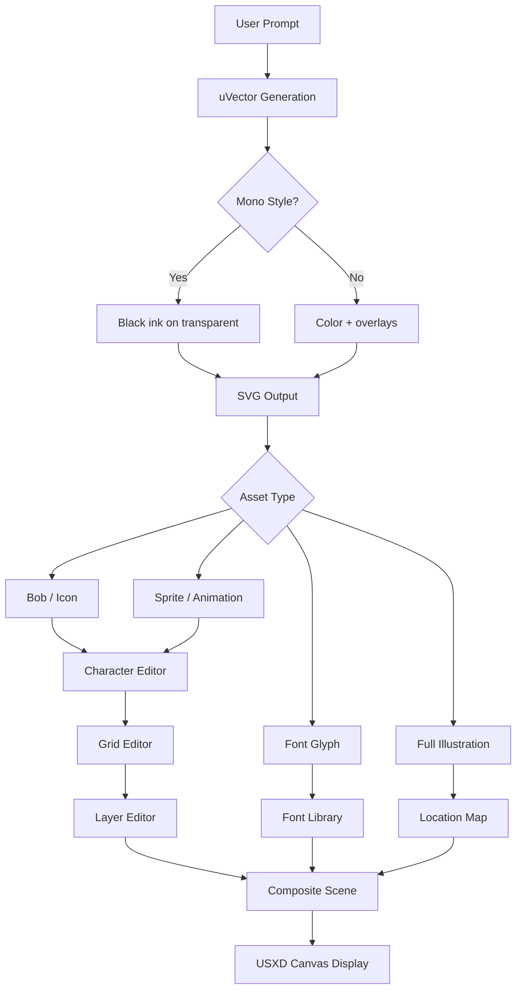

# uVector — Integration with ProseUI, GridUI, and Character/Layer/Grid Editors

See also: `docs/NANO_BANANA_UVECTOR_SUMMARY.md` for the vendor/uVector summary
aligned to the current split-repo manifest configuration.

> **Status:** Draft  
> **Last Updated:** 2026-06-13  
> **Version:** 1.0.0

## Overview

uVector serves as the **image intelligence and vector rendering engine** for uDOS's multi-paradigm UI system. It bridges three distinct interface modalities:

| UI Mode      | Primary Use                                            | uVector Role                                                   |
| ------------ | ------------------------------------------------------ | -------------------------------------------------------------- |
| **ProseUI**  | Document editing, narrative flows, rich text           | Renders inline sprites/bobs, fonts, scene descriptions         |
| **GridUI**   | Teletext/ASCII views, terminal interfaces, pixel grids | Converts Mono outputs to character-cell graphics               |
| **CanvasUI** | Vector graphics, layered compositions, maps            | Handles SVG layer stacking, coordinate mapping, virtual layers |

---

## 1. ProseUI Integration — Narrative + Visual Assets

### Core Concept

ProseUI treats the interface as a **living document** — paragraphs, dialogue blocks, and scene descriptions interleaved with visual assets.

### uVector Contributions

| ProseUI Element         | uVector Rendering Pipeline                                                                               |
| ----------------------- | -------------------------------------------------------------------------------------------------------- |
| **Inline sprites/bobs** | Generated Mono outputs → converted to character-aligned sprites → injected as `::before` pseudo-elements |
| **Font rendering**      | Text prompts for glyph sets → uVector generates bitmap font sheets → mapped to character codes           |
| **Scene illustrations** | `generate_image` with `tier: "platinum"` → SVG layer → anchored to prose blocks                          |
| **Icons (bobs)**        | Small Mono style generations → 16×16 or 32×32 SVG bobs → used as bullet points or inline icons           |

### Technical Flow

```typescript
// ProseUI component requesting an inline bob
<ProseBlock>
  <InlineBob prompt="heart icon" style="mono_chrome" size="16x16" />
  <TextBlock>The character feels a warm glow.</TextBlock>
</ProseBlock>

// uVector generates → caches in vault → returns SVG data URL
// Result: [♥] The character feels a warm glow.
```

### Character Cell Mapping (for Sprites)

```
Mono output (512×512) → uGrid analysis → extract 8×8 or 16×16 cells → map to ProseUI character positions
Each cell becomes a "sprite" that can be referenced by character name in prose
```

---

## 2. GridUI — Teletext + ASCII Support

### Core Concept

GridUI renders the interface as a **character cell grid** (inspired by teletext, PETSCII, ANSI art). Every screen position is a character cell with foreground/background attributes.

### uVector Grid Rendering Pipeline

| GridUI Feature            | uVector Mechanism                                                                              |
| ------------------------- | ---------------------------------------------------------------------------------------------- |
| **Teletext mode**         | `style_preset: "mono_teletext"` → enforces 6×10 pixel block rendering (PAL teletext standard)  |
| **ASCII conversion**      | `describe_image` → returns character approximations (dithering maps to `@%#*+:-.` )            |
| **Cell attributes**       | Mono line layer → foreground (ink) / background (transparent) → mapped to terminal color codes |
| **Grid-aware generation** | `ugrid` parameter → canvas divided into utiles → each utile rendered as independent cell       |

### Teletext-Specific Generation

```typescript
// Generate a teletext-style weather map
await generate_image({
  prompt: "UK weather map with isobars",
  style_preset: "mono_teletext",
  ugrid: { width_utiles: 40, height_utiles: 25, positioning: "full frame" },
});

// Output: 40×25 character grid, each cell = 6×10 pixels (teletext block)
// Each cell can hold 1 of 96 characters + foreground/background colors
```

### ASCII Art Dithering Pipeline

```
Gemini output (PNG) → uVector quantizer → 2bpp (black/white) → map to ASCII density
• Darkest regions → "@" or "#"
• Mid regions → "%", "*", "+", "-"
• Light regions → ":", "."
• Whitespace → " "
```

### Character Editor Integration

```
GridUI cell (position X,Y) ←→ Character Editor sprite definition
- Each cell can reference a uVector-generated bob
- Bobs are stored in vault/.udos/sprites/{id}.svg
- Character Editor edits the bob → GridUI updates all instances
```

---

## 3. Character Editor — Sprites and Bobs

### Core Concept

The Character Editor manages **reusable visual assets** (sprites, bobs, fonts) that can be placed across ProseUI, GridUI, and CanvasUI.

### uVector Asset Pipeline

| Asset Type | Definition                      | uVector Generation                                 | Storage                       |
| ---------- | ------------------------------- | -------------------------------------------------- | ----------------------------- |
| **Sprite** | Multi-frame character animation | `compose_images` → generates 4–8 frame walk cycles | `vault/.udos/sprites/{name}/` |
| **Bob**    | Single static icon/object       | `generate_image` with specific `ugrid` cell        | `vault/.udos/bobs/{name}.svg` |
| **Font**   | Complete character set          | `generate_image` for each glyph (A–Z, 0–9)         | `vault/.udos/fonts/{name}/`   |

### Character Editor Workflow

```
1. Designer describes character: "8-bit warrior with red cape, pixel art style"
2. uVector generates sprite sheet (4 frames facing down)
3. Character Editor displays frames, allows cell-by-cell editing
4. Each frame exported as Mono-compliant SVG (black ink only)
5. Color overlay applied in editor (separate layer per uDOS spec)
```

### Bob Library Structure

```yaml
# vault/.udos/bobs/inventory.yaml
- id: health_potion
  prompt: "red potion with heart label, mono_chrome"
  variants: [full, half, empty]
  default_size: "16x16"

- id: treasure_chest
  prompt: "wooden chest with gold trim, mono_blueprint"
  states: [closed, open]
  animations: [idle, open_sequence]
```

### Font Generation Pipeline

```typescript
// Generate a complete bitmap font
for (const char of "ABCDEFGHIJKLMNOPQRSTUVWXYZ0123456789") {
  const glyph = await generate_image({
    prompt: `glyph '${char}', monospace bitmap, 8x8 grid, mono_teletext`,
    ugrid: { width_utiles: 1, height_utiles: 1, positioning: "center" },
  });
  // Store as vault/.udos/fonts/pixel/{char}.svg
}
```

---

## 4. Grid Editor — Grids Made of Cells

### Core Concept

The Grid Editor manages **tiled compositions** — each grid is a 2D array of cells, where each cell can contain a sprite, bob, or character.

### uVector Grid Mapping

| Grid Concept | uVector Implementation                                 |
| ------------ | ------------------------------------------------------ |
| **Cell**     | Single utile in `ugrid` system                         |
| **Grid**     | Complete `ugrid` canvas (width_utiles × height_utiles) |
| **Layer**    | One grid = one layer in the layer stack                |
| **Tile**     | Bob or sprite assigned to a cell                       |

### Grid Coordinate System

```
uGrid specification:
- width_utiles: 16
- height_utiles: 16
- positioning: "character at (4,2) moves to (8,8)"

Maps directly to Grid Editor's internal coordinate system:
cellReference = (row * width_utiles) + column
```

### Cell-to-Asset Binding

```typescript
interface GridCell {
  position: { x: number; y: number }; // in utiles
  asset: {
    type: "sprite" | "bob" | "char";
    id: string;
    frame?: number; // for animated sprites
  };
  attributes: {
    foreground: string; // ink color (#000000 usually)
    background: string; // transparency or color
    flip?: "h" | "v";
    rotate?: 0 | 90 | 180 | 270;
  };
}
```

### Grid Rendering Pipeline

```
Grid Editor saves grid.json → uVector reads grid →
For each cell, fetch SVG from vault → apply transformations →
Compose into single SVG with cell-accurate positioning →
Return to CanvasUI for display
```

---

## 5. Layer Editor — Stacks of Grids

### Core Concept

The Layer Editor manages **multiple grids stacked vertically** — like an onion skin or compositing system. Each layer is an independent grid that can be shown/hidden/reordered.

### uVector Layer Composition

| Layer Operation      | uVector Processing                                             |
| -------------------- | -------------------------------------------------------------- |
| **Layer stack**      | Each layer rendered sequentially → alpha compositing           |
| **Virtual layers**   | Metadata-only layers that don't render (for collision, events) |
| **Blend modes**      | SVG `mix-blend-mode` applied per layer                         |
| **Layer transforms** | Offset, scale, rotate applied before composition               |

### Virtual Layer System

```typescript
// Physical layer (visible)
layer 0: background grid (terrain)

// Virtual layers (non-rendering, used for game logic)
layer 1: collision map (where characters can walk)
layer 2: event triggers (dialogue zones)
layer 3: spawn points

// Physical layer (visible)
layer 4: character sprites

// uVector renders only physical layers
// Virtual layers exported as JSON for game engine
```

### Layer Composition Example

```yaml
# vault/maps/dungeon/layers.yaml
layers:
  - name: "floor"
    type: physical
    grid: "floor_grid.json"
    blend: "normal"

  - name: "collision"
    type: virtual
    grid: "collision_grid.json"
    # Not rendered, but collision data extracted

  - name: "decorations"
    type: physical
    grid: "decor_grid.json"
    blend: "multiply"

  - name: "characters"
    type: physical
    grid: "char_grid.json"
    blend: "normal"
    offset_y: -8 # lift sprites slightly
```

### Layer Rendering Flow

```
Layer Editor exports layer stack → uVector process:
1. Render each physical layer independently (from bottom to top)
2. Apply layer transforms and blend modes
3. Composite into final SVG
4. Extract virtual layer data to JSON
5. Return { image: "composite.svg", metadata: virtualLayers }
```

---

## 6. Location Mapping + Virtual Layers

### Core Concept

Locations in uDOS are **composite spaces** — combinations of physical layers (visual) and virtual layers (logic). uVector maps between visual coordinates and logical game space.

### Location Asset Structure

```yaml
# vault/locations/castle_courtyard.yaml
location:
  name: "Castle Courtyard"
  size: { width_utiles: 32, height_utiles: 32 }

  layers:
    ground:
      type: physical
      grid: "courtyard_floor.json"

    walls:
      type: physical
      grid: "courtyard_walls.json"
      collision: true

    objects:
      type: physical
      bob_map: # Maps grid cells to bobs
        "(5,5)": "fountain"
        "(12,8)": "statue"

    events:
      type: virtual
      triggers:
        - cell: "(10,10)"
          action: "start_battle"
        - cell: "(20,20)"
          action: "open_gate"

    pathfinding:
      type: virtual
      navigation_mesh: "courtyard_nav.json"
```

### Coordinate Transformation

```typescript
// Screen to Game Space (with uVector)
screenPixel (x, y) → uGrid cell (col, row) → Virtual layer collision check
→ Game engine receives cell coordinates for logic

// Game Space to Screen (rendering)
Game coordinate (col, row) → uGrid cell mapping →
uVector renders character bob at cell center →
CanvasUI displays in USXD centre region
```

### Import/Export Pipeline

```
External assets:
├── Fonts (.ttf, .woff2) → uVector converts to bitmap font sheets
├── Sprites (.png, .gif) → uVector extracts frames → Mono conversion
├── Game maps (Tiled .tmx) → Import → uVector grid conversion
└── Story data (JSON, YAML) → Virtual layer generation

All imports stored in vault/.udos/imports/{original_name}/
Maintains original + uDOS Mono version
```

---

## 7. Complete Asset Pipeline Summary



---

## Key Integration Points Summary

| Editor               | uVector Role                                 | Output Format                       |
| -------------------- | -------------------------------------------- | ----------------------------------- |
| **ProseUI**          | Inline bob rendering, scene illustrations    | SVG data URLs + text annotations    |
| **GridUI**           | Cell-to-character mapping, teletext encoding | 8×8 or 16×16 cell grids             |
| **Character Editor** | Sprite sheet generation, frame extraction    | Multi-layer SVG with frame metadata |
| **Grid Editor**      | Grid composition, cell asset binding         | Grid JSON + SVG tileset             |
| **Layer Editor**     | Layer stacking, blend modes, transforms      | Composite SVG + virtual layer JSON  |
| **Location Mapper**  | Coordinate mapping, collision extraction     | Scene SVG + navigation mesh         |

---

## uDOS Vault Storage for Assets

```
vault/
├── .udos/
│   ├── bobs/           # Single icons
│   ├── sprites/        # Animated characters
│   ├── fonts/          # Bitmap font sheets
│   ├── grids/          # Grid definitions
│   ├── layers/         # Layer stacks
│   ├── locations/      # Complete maps
│   ├── imports/        # External assets
│   └── cache/          # Generated images (original)
├── system/
│   ├── config.md       # uVector defaults
│   └── memory.md       # Generation history
└── worlds/
    └── [world_name]/   # Game/story-specific assets
```

---

**uVector is not just an image generator — it's the visual foundation of uDOS's multi-paradigm interface, enabling seamless flow between prose, grids, characters, and layers while maintaining the Mono design language across all modalities.**
